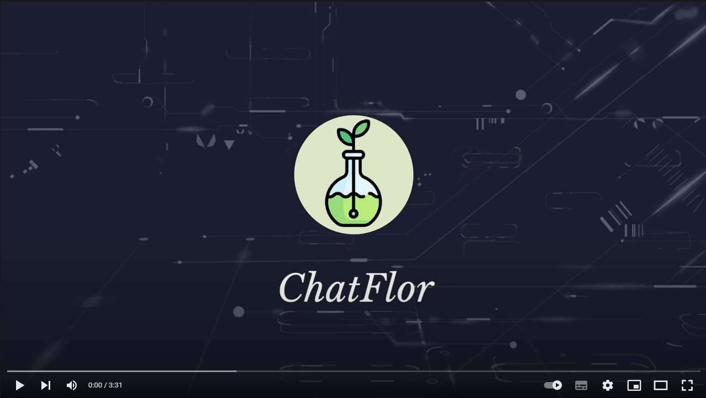

<div id="top"></div>

# ChatFlor » Chat Desktop App
Click on the image to be redirected to the video (pt-br)
[](https://youtu.be/KarST4bMkqg)

## About The Project

The project is a complaint chat, the project aims to be applied in a factory or a service location where the use of cell phones is restricted, either due to lack of signal or to increase employee productivity (avoiding distractions caused by it). 
Each sector of the company must have a machine with the software interface accessible to all, where they will request a token to communicate with the sector responsible for environmental security. 
There is also the interface that will be used by analysts where complaints/warnings will be handled, those responsible will forward them to the sector capable of solving the incident or providing assistance, guiding the user to perform the necessary procedure.
<details>
  <summary><strong>project's images</strong></summary>
  <ul>
    
    
    
    
  </ul>
</details>

[📄 Read Full documentation](./assets/APS%202022.1.pdf)

## 👷‍♂️ How to Run:

#### 1. Downloads & Dependences:
- Download Visual Studio Community 2017 [here 🧱](https://my.visualstudio.com/Downloads?q=visual%20studio%202017&wt.mc_id=o~msft~vscom~older-downloads)

- Download dotNet v4.8 developerPack [here 🧱](https://dotnet.microsoft.com/en-us/download/visual-studio-sdks?utm_source=getdotnetsdk&utm_medium=referral)

#### 2. Clone and Run

```bash
git clone https://github.com/ThiagodePaulaSouza/APS_5-semestre.git
```
- Open in visual studio
- Run as release **Aps5**
- Run as release **ChatServer**
- Enjoy 😄

## ~~🥳 Como Ajudar~~:

##### 1. Before Any Thing:

fork the project
``````bash
# setup your git
# remove ()
git remote add origin (YourUrlProject)
git pull origin
git checkout -b (YourBranch)
``````

##### 2. After Your Amazing Feature:

``````bash
# after changes
# remove ()
git status
git add (filesChanged)
git commit -m ("Amazing Message about your changes / features")
git push -u origin (YourBranch)
``````

##### 3. Now on the GitHub:

- Click in Compare & pull request
- Add your comments about the project
- Click on Create pull request

<p align="right">(<a href="#top">back to top</a>)</p>
